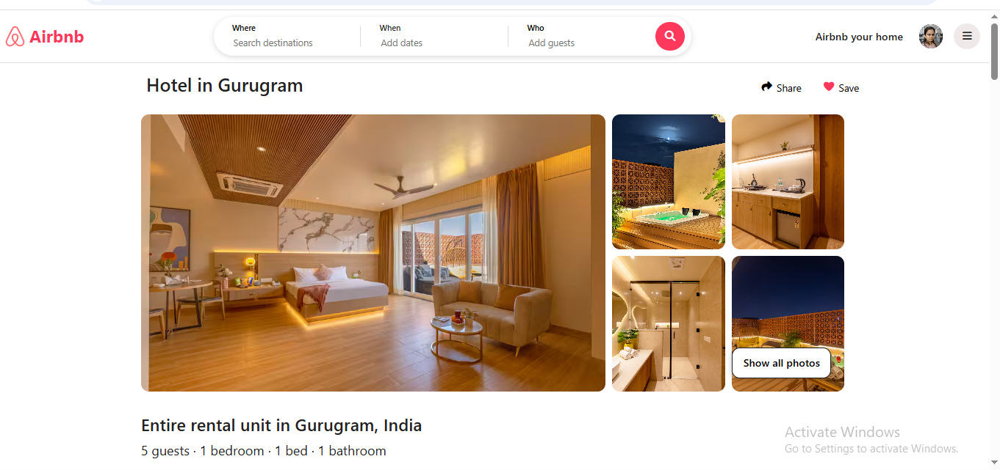
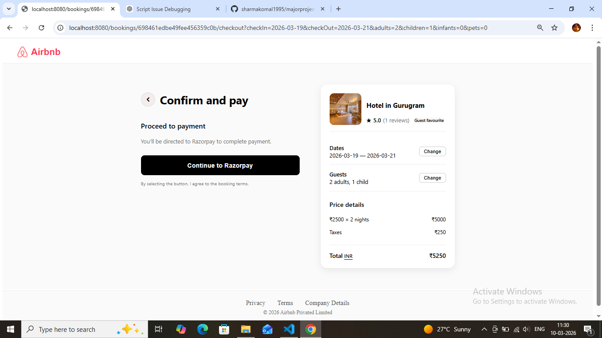

# Airbnb Clone – Full Stack Web Application

## Project Description

This project is a **full-stack Airbnb-style web application** where users can explore property listings, book stays, communicate with hosts, and manage their travel experience.

The application is built using **Node.js, Express.js, MongoDB, EJS, HTML, CSS, Bootstrap, and JavaScript** and follows the **MVC (Model–View–Controller) architecture** for better code organization and scalability.

---

# Project Preview

## Home Page


## Listing Details Page



## Booking System



---

# Tech Stack

### Frontend

* HTML
* CSS
* Bootstrap
* JavaScript
* EJS (Embedded JavaScript Templates)

### Backend

* Node.js
* Express.js

### Database

* MongoDB

### Architecture

* MVC (Model-View-Controller)

---

## Key Features
# User Authentication

* Users can sign up and log in securely.

* Each user can manage their personal account.

## Features

## Property Listings

* Users can browse different property listings.
* Each listing contains images, description, price, and location.
* Listings can be **shared with others**.

---

## Booking System

The application includes a complete **booking system** that allows users to reserve listings by selecting check-in and check-out dates.

### Key Booking Features

* Users can select **check-in and check-out dates** before booking a property.
* The total booking price is automatically calculated based on the **number of nights** and listing price.
* Payments are integrated using **Razorpay (Test Mode)** for demonstration and testing purposes.
* After a successful booking:

  * The user receives a **confirmation email**.
  * A **confirmation message is sent to the user's mobile number**.
* Users can **download their booking details** after completing a reservation.
* Bookings can also be **cancelled by the user** if needed.

---

## Wishlist Feature

* Users can save listings to their wishlist.
* Wishlist items are stored in **MongoDB database**.

---

## Reviews and Ratings

* Guests can give **overall ratings** to listings.
* Users can also give **category-based ratings**.
* Guests can **edit or delete their reviews**.

---

## Map Integration

* Listing locations are displayed on an interactive map.
* Implemented using **Mapbox and Leaflet**.
* Helps users easily view the exact location of a property.

---

## Messaging System

* Guests can send messages to hosts.
* Hosts can reply to guest messages.
* Messages are stored in **MongoDB** and handled using **JavaScript and Express routes**.
* The messaging system works in **real-time style interaction**.

---

## Host Controls

Hosts can manage their listings:

* Edit listing information
* Delete listings
* Update property details

---

## Profile Management

Users can:

* Edit profile information
* View past trips
* View connections
* Access their profile details in the **About section**

---

## Privacy & Terms

* Users can access privacy and terms information.
* Guests can also submit **feedback**.

---

# Project Architecture

This project follows the **MVC architecture**:

Models → MongoDB schema definitions
Views → EJS templates for UI
Controllers → Business logic
Routes → Request handling

This structure keeps the code **clean, organized, and scalable**.

---

# Run the Project Locally

Install dependencies

```bash
npm install
```

Start the server

```bash
nodemon app.js
```

Open in browser

```bash
http://localhost:8080
```

---

# Author

Komal Sharma
